# Architecture Documentation

## Overview

This is an AI assistant application that implements direct MCP (Model Context Protocol) integration with MongoDB Atlas knowledge base and  LLM endpoints. The architecture follows a clean separation of concerns with async services and proper error handling.

## Architecture Diagram

```mermaid
graph TB
    %% User Interface Layer
    User[👤 User] --> API[🌐 FastAPI Application<br/>Port 8000]
    
    %% API Endpoints
    API --> Health[🏥 /healthz<br/>Health Check]
    API --> Chat[💬 /chat<br/>Chat Completion]
    API --> Search[🔍 /search<br/>Document Search]
    API --> SearchDebug[🔧 /search/debug<br/>Search Diagnostics]
    API --> Ingest[📥 /ingest_github<br/>GitHub Ingestion]
    API --> Count[📊 /documents/count<br/>Document Count]
    API --> MCPInfo[ℹ️ /mcp/info<br/>MCP Server Info]
    API --> Docs[📚 /docs & /redoc<br/>API Documentation]
    
    %% Core Services Layer
    Chat --> LLMService[🤖 LLM Service<br/>OpenAI Compatible Client]
    Search --> MongoService[🗄️ MongoDB Service<br/>Atlas Connection]
    SearchDebug --> MongoService
    Count --> MongoService
    Ingest --> GitHubService[🐙 GitHub Service<br/>Repository Processing]
    
    %% LLM Service Flow
    LLMService --> LLMEndpoint[🚀 LLM Endpoint<br/>Llama3-8B-Instruct<br/>deepseek-coder-6.7b-instruct]
    LLMService --> MCPTools[⚙️ MCP Tools<br/>Direct Tool Calling]
    
    %% MCP Server Integration
    MCPTools --> MCPServer[🔧 FastMCP Server<br/>ChatGTG v0.1.0]
    MCPServer --> SearchTool[🔍 search_documents<br/>Enhanced Relevance]
    MCPServer --> SemanticTool[🧠 search_documents_semantic<br/>Advanced Search]
    MCPServer --> AllDocsTool[📄 get_all_documents<br/>Bulk Retrieval]
    MCPServer --> CountTool[📊 get_document_count<br/>Statistics]
    MCPServer --> MetadataTool[🏷️ search_documents_by_metadata<br/>Filtered Search]
    
    %% Database Layer
    SearchTool --> MongoService
    SemanticTool --> MongoService
    AllDocsTool --> MongoService
    CountTool --> MongoService
    MetadataTool --> MongoService
    GitHubService --> MongoService
    
    MongoService --> MongoDB[(🍃 MongoDB Atlas<br/>Database: rag_db<br/>Collection: documents)]
    
    %% External Services
    GitHubService --> GitHub[🐙 GitHub API<br/>Repository Access]
    
    %% Configuration
    Config[⚙️ Configuration<br/>.env Settings] --> API
    Config --> LLMService
    Config --> MongoService
    Config --> GitHubService
    Config --> MCPServer
    
    %% Styling
    classDef userLayer fill:#eeee
    classDef apiLayer fill:#f3e5f5
    classDef serviceLayer fill:#e8f5e8
    classDef mcpLayer fill:#fff3e0
    classDef dataLayer fill:#fce4ec
    classDef externalLayer fill:#f1f8e9
    
    class User userLayer
    class API,Health,Chat,Search,SearchDebug,Ingest,Count,MCPInfo,Docs apiLayer
    class LLMService,MongoService,GitHubService serviceLayer
    class MCPTools,MCPServer,SearchTool,SemanticTool,AllDocsTool,CountTool,MetadataTool mcpLayer
    class MongoDB dataLayer
    class LLMEndpoint,GitHub,Config externalLayer
```

## Detailed Component Description

### 1. FastAPI Application Layer

**Main Application (`app/main.py`)**
- CORS-enabled FastAPI application
- Async request handling
- Comprehensive error handling and logging
- Swagger/ReDoc auto-documentation

**API Endpoints:**
- `GET /healthz` - System health check with MongoDB connection status
- `POST /chat` - Chat completion with direct MCP tool calling
- `POST /search` - Direct document search with enhanced error handling
- `GET /search/debug` - Search diagnostics and troubleshooting
- `POST /ingest_github` - GitHub repository document ingestion
- `GET /documents/count` - Total document count retrieval
- `GET /mcp/info` - MCP server information and available tools

### 2. Service Layer

**LLM Service (`app/services/llm_service.py`)**
- OpenAI-compatible async client
- Custom JSON function call parsing for VLLM compatibility
- Direct MCP tool calling via `mcp._mcp_call_tool()`
- Two-stage response generation:
  1. Tool call detection and execution
  2. Conversational response synthesis

**MongoDB Service (`app/services/mongodb_service.py`)**
- Async MongoDB Atlas connection management
- Enhanced context-aware search relevance scoring
- Multi-stage search algorithm:
  - Stage 1: Conceptual priority matching
  - Stage 2: Text search with penalties/bonuses
  - Stage 3: Keyword fallback
- Semantic search with aggregation pipeline
- Document CRUD operations

**GitHub Service (`app/services/github_service.py`)**
- Repository cloning and processing
- File pattern matching and filtering
- Document extraction and metadata generation
- Batch document insertion to MongoDB

### 3. MCP Integration Layer

**FastMCP Server (`app/mcp_server.py`)**
- FastMCP v2.10.1 framework
- Tool registration with `@mcp.tool()` decorators
- Resource endpoints for server info and database status
- Error handling with graceful fallbacks

**Available MCP Tools:**
- `search_documents` - Enhanced relevance-based text search
- `search_documents_semantic` - Advanced semantic search with fuzzy matching
- `get_all_documents` - Bulk document retrieval with limits
- `get_document_count` - Database statistics
- `search_documents_by_metadata` - Filtered search by document metadata

### 4. Data Models (`app/models.py`)

**Core Models:**
- `Document` - Primary document model with metadata
- `ChatRequest/ChatResponse` - Chat API request/response models
- `GitHubIngestRequest/GitHubIngestResponse` - Repository ingestion models
- `DocumentSearchRequest/DocumentSearchResponse` - Search API models

### 5. Configuration Management (`app/config.py`)

**Environment Variables:**
- MongoDB Atlas connection settings
- LLM endpoint configuration (Llama3-8B-Instruct, deepseek-coder-6.7b-instruct)
- GitHub API token
- MCP server settings
- Application logging and host configuration

## Data Flow Architecture

### Chat Completion Flow

### Document Search Flow

### GitHub Ingestion Flow

## Enhanced Search Relevance Algorithm

The MongoDB service implements a sophisticated context-aware search algorithm:

### Stage 1: Conceptual Priority
- Exact title matches get highest scores
- "What is X" conceptual queries prioritized
- Standalone concept detection (not part of technical phrases)

### Stage 2: Text Search with Context Penalties
- MongoDB text search with relevance scoring
- Penalties for technical compound phrases (e.g., "launchpoint search")
- Bonuses for conceptual indicators ("definition", "overview")

### Stage 3: Keyword Fallback
- Keyword-based search for broader coverage
- Lower relevance scores for fallback matches

### Semantic Search Enhancement
- Aggregation pipeline with advanced scoring
- Title match bonuses and content length preferences
- Recency bonuses and technical phrase penalties

## Error Handling & Resilience

### Connection Management
- Automatic MongoDB reconnection attempts
- Graceful degradation when services unavailable
- Comprehensive error logging and user feedback

### Search Diagnostics
- `/search/debug` endpoint for troubleshooting
- Connection status, document counts, and sample queries
- Detailed logging throughout search stages

### LLM Integration Resilience
- VLLM compatibility without OpenAI tool calling
- Custom JSON parsing with regex fallbacks
- Two-stage response generation for robustness

## Deployment Architecture

### Local Development
- Poetry dependency management
- FastAPI development server with auto-reload
- Task automation via Taskfile.yml

### Production Considerations
- Async architecture for high concurrency
- MongoDB Atlas for scalable document storage
- Your LLM endpoint integration
- Comprehensive logging and monitoring hooks

## Security & Configuration

### Environment-based Configuration
- Secure credential management via .env files
- Separate development and production settings
- No hardcoded secrets or API keys

### API Security
- CORS configuration for cross-origin requests
- Input validation via Pydantic models
- Comprehensive error handling without information leakage

## Performance Optimizations

### Database Operations
- Async MongoDB operations throughout
- Efficient aggregation pipelines for semantic search
- Proper indexing strategies for text search

### LLM Integration
- Streaming-capable OpenAI client
- Efficient tool call detection and parsing
- Minimal round-trips for chat completion

### Caching Considerations
- Document search results suitable for caching
- MCP tool responses cacheable by query
- Connection pooling for MongoDB Atlas

## Monitoring & Observability

### Logging Strategy
- Structured logging throughout application
- Debug-level search stage logging
- Error tracking with full context

### Health Checks
- MongoDB connection status monitoring
- MCP server availability checks
- LLM endpoint connectivity validation

### Metrics Collection Points
- Search query performance and results
- Document ingestion rates and success
- Chat completion latency and tool usage

This architecture provides a robust, scalable foundation for the ChatGTG AI assistant with direct MCP integration, enhanced search capabilities, and production-grade reliability.
